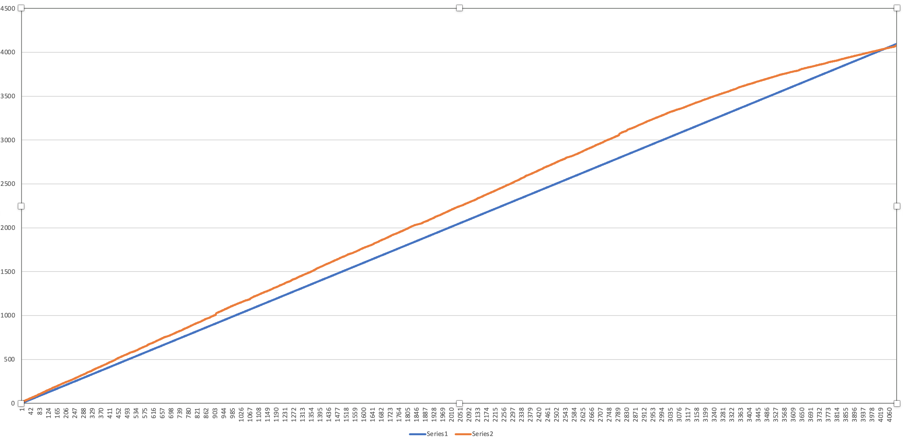

# Peripheral

***Important: This needs to be in a folder next to the folder of the [Controller](https://github.com/nicklasb/Controller) project.***

This is a peripheral unit for collecting data from sensors and forwarding to a [central Controller](https://github.com/nicklasb/Controller) using:  
* Competent multi-core usage for maximal performance and stability
* BLE for common, always-on situations 
* Waking Controller and being woken using GPIO, then BLE for low-power situations and to sound alarms.   
*Like intrusion (theft, camera), danger (fire, leaks)*

The first evolution is hard-coded to a specific setup, the next will attempt to be more dynamic.

# Progress
Done:
* A buildable Platform IO project
* Create a custom BLE peripheral that sends any data to the controller
* Using [https://github.com/e-tinkers/esp32-adc-calibrate], I made a calibration lookup table,  which *hugely* improves the precison for resistance based sensors, like termistors and mechanical level meters. Perhaps this shouldbe included as a feature of the peripheral?

WIP:
* Create a real peripheral and try that out during summer.

Upcoming:
* Implement a simple high-level protocol that effeciently can send many kinds of sensor data
* Implement support for a lot of different sensors in the peripherals (see that repo)

## Platform

### Software
This is an esp-idf project, and even though I'd prefer it being pure PlatformIO, I had
to change it around (use /main) to make it work with Arduino ESP32, which currently doesn't work properly on PlatformIO. 
It was not all bad though, I hade to move things into proper ESP-IDF-components, and that isn't lost as it will 
probably make it easier to move back into PlatformIO again at some point.

### Hardware

- TTGO LoRa32 module (CH9102) 
    - Bluetooth Low Energy (BLE)
    - ESP32 WROVER
    - LoRa 868mhz (This project doesn't use LoRa, at least not initially) 
    - SSD1306 OLED (will not be used initially)

I use this module just because I hade it lying around, the real stuff will be whatever cheap ESP32:s i stumble upon.

## Custom 

These are settings that might be, and probably is, specific to my setup.  

### Serial flasher config

- Flash SPI mode (QIO)  --->
- Flash SPI speed (80 MHz)  --->  
*These were the flash settings that worked for the LoRa32.*

- CONFIG_ESP32_DEFAULT_CPU_FREQ_MHZ needs to be 240Mhz. For some reason that isn't the default all the time. 
- CONFIG_ESP32_XTAL_FREQ needs to be 26 Mhz. The crystal seems to be 26 even though the default is 40 Mhz in the ESP32 menuconfig 

### Component config 

#### Bluetooth
Uses Nimble, and mostly defaults.  
*(in contrast, the [ble_server](https://github.com/nicklasb/ble_server) and [ble_client](https://github.com/nicklasb/ble_client) repos explore the extremes of MTU sizes and transfer rates and other tricks, if that is of interest)*  

- [x] Bluetooth
    - Bluetooth controller(ESP32 Dual Mode Bluetooth)  --->  
     Bluetooth controller mode (BR/EDR/BLE/DUALMODE) (BLE Only)  --->  
    - Bluetooth Host (NimBLE - BLE only)  --->  
    - NimBLE Options  --->  

### Arduino
Notable Arduino settings, no setup and loop, and the only thing included is something it seems I have to have(https://github.com/espressif/arduino-esp32/issues/6788):
- [ ] Autostart Arduino setup and loop on boot
- [x] Include only specific Arduino libraries
    - [x] Enable ArduinoOTA

Basically I only need stream.h.

## TODO:

